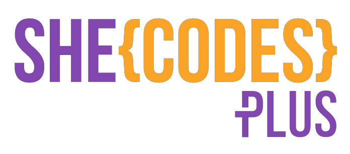
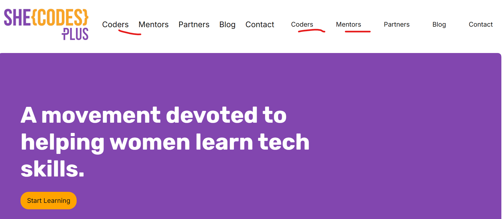
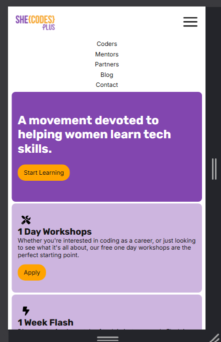

HTML/CSS Lesson content for Shecodes 2025 - example website

#This is an example H1

---

I just love **bold text**.

    

    My favorite search engine is [Duck Duck Go](https://duckduckgo.com).

#Screenshots

Responsiveness example:

Desktop Screenshot:

Mobile screenshot:

